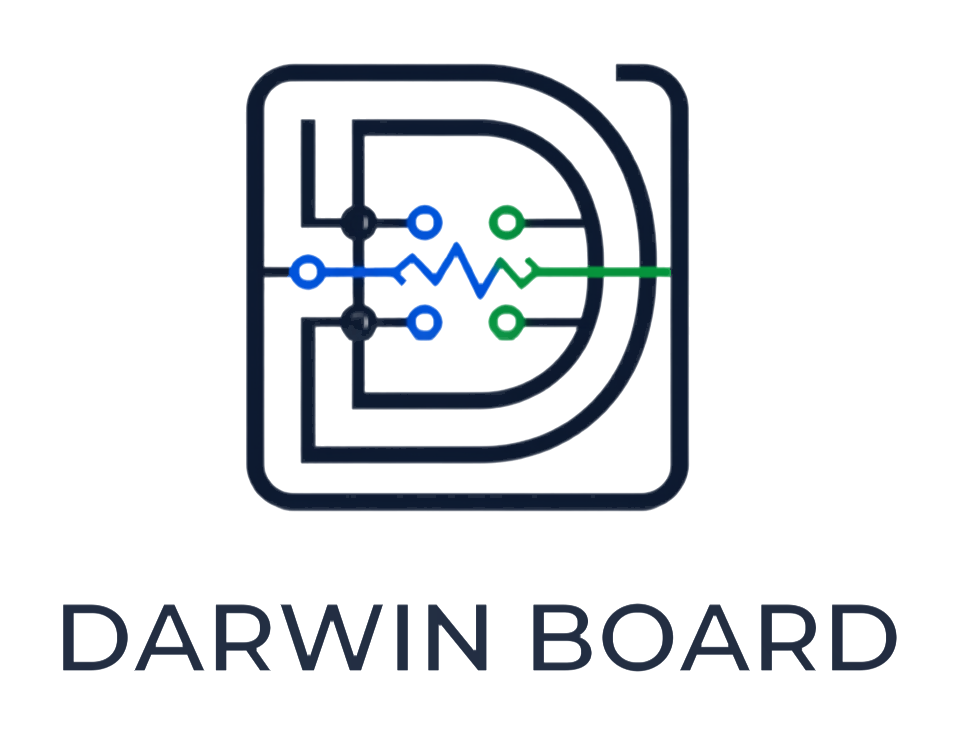
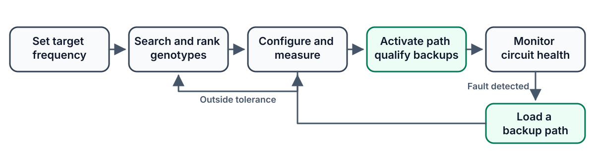

# Darwin Board

<p align="center">
  
</p>

Darwin Board is an ESP32-controlled RC filter with 2,040 possible circuit
paths. It searches for a path that matches a requested cutoff frequency,
measures the result, stores reliable alternatives, and changes route when the
active circuit degrades.

## Architecture



## How it works

1. Each resistor and capacitor combination receives a binary genotype.
2. Measured survivors produce children through crossover and mutation.
3. A Bayesian model chooses which children are worth testing on hardware.
4. The strongest route becomes active while backups are tested in advance.
5. Health checks detect response changes and trigger recovery.

## Run the lab

```bash
python3 -m pip install -e .
PYTHONPATH=src python3 -m darwin_board.visualizer_server
```

Open [http://127.0.0.1:8765](http://127.0.0.1:8765) and select **Run autonomous
cycle**.

## ESP32

```bash
cd firmware/esp32
pio run
pio run --target upload
pio device monitor
```

See the [ESP32 build guide](docs/esp32-build.md) for parts and wiring.

## Documentation

Read the [technical overview](docs/README.md) for the control loop, benchmark,
ESP32 build, testing commands, and full documentation index.
