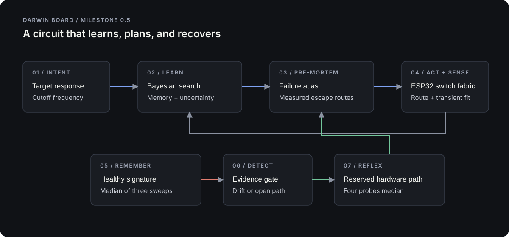

# Darwin Board



Darwin Board is a self-tuning RC filter with reconfigurable component paths.
Set a cutoff frequency and the controller finds a matching circuit, checks a
backup for each active component, and monitors the response. If a component
fails, it tries the prepared backups before starting a fresh search.

## How it works

1. The optimizer measures promising resistor and capacitor paths.
2. The best path becomes active while backups are tested in advance.
3. Repeated health checks detect a lasting change in the filter response.
4. The controller tries its prepared backups, then searches again if needed.

## Run the lab

```bash
python3 -m pip install -e .
PYTHONPATH=src python3 -m darwin_board.visualizer_server
```

Open [http://127.0.0.1:8765](http://127.0.0.1:8765) and select **Run autonomous
cycle**.

## ESP32

```bash
cd firmware/esp32
pio run
pio run --target upload
pio device monitor
```

See the [ESP32 build guide](docs/esp32-build.md) for parts and wiring.

## Documentation

Read the [technical overview](docs/README.md) for the control loop, benchmark,
ESP32 build, testing commands, and full documentation index.
